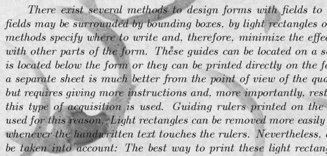
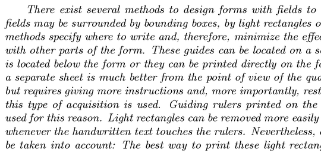

# SSN. Lab. 12. Autoenkodery

Zapoznaj się z zawartością notatnika Jupyter umieszczonego w repozytorium  i wykonaj zawarte w nim ćwiczenia.

Notatnik: [autoencoder.ipynb](https://github.com/IS-UMK/ssn_23_lab_12/blob/master/autoencoder.ipynb)
 

---

## Zad. 12. Autoenkoder czyszczący dokumenty

Katalog [dane/document_denoising/](dane/document_denoising/) zawiera obrazy (skany) zawierające próbki tekstu wraz z różnorodnymi zniekształceniami.  
Zadanie polega na zbudowaniu modelu usuwającego zniekształcenia z obrazów.  
Dane treningowe zawarte w podkatalogu ``dane/document_denoising/train/`` zawierają 144 obrazów o maksymalnym rozmiarze  420x540.

W katalogu ``dane/document_denoising/train_cleaned/`` znajdują się odpowiadające im obrazy bez zniekształceń.  

Zbuduj głęboki autoenkoder z warstwami splotowymi o jak najlepszej jakości usuwania zniekształceń i zastosuj go na 4 obrazach testowych znajdujących się w katalogu ``dane/document_denoising/test/``.

Rozwiązanie w postaci notatnika Jupyter (``.ipynb``) lub skrypt w języku Python (``.py``) umieść w Moodle lub prześlij do repozytorium GitHub.

---
## Materiały:

* [Building Autoencoders in Keras](https://blog.keras.io/building-autoencoders-in-keras.html), The Keras Blog
